# Trait diagrams

This document contains the trait diagrams for the engine. The traits are grouped by their functionality and how they 
are linked to each other. These traits form the boundaries of the engine and are used to separate the different 
components.

In other words, it should be possible to implement a different system for Nodes without changing anything else and it 
would still function correctly. The same goes for the CSS system, the query system, and the rendering system.

```mermaid
---
title: Gosub Engine Traits
---
classDiagram
    HasCssSystem --> CssParser 

    CssStylesheet --> HasCssSystem
    CssRule --> HasCssSystem
    CssDeclaration --> HasCssSystem
    CssValue --> HasCssSystem
    
    namespace Css {
        class HasCssSystem {
            <<interface>> CssStylesheet
            <<interface>> CssRule
            <<interface>> CssDeclaration
            <<interface>> CssValue
        }   

        class CssParser {
            <<interface>> HasCssParser
            +parse_str()
        }
        
        class CssValue {
            +new() CssValue
        }
        
        class CssRule {
            +new() CssRule
        }
        
        class CssDeclaration {
            +new() CssDeclaration
        }   
        
        class CssStylesheet {
            +new() CssStylesheet
        }
    }
    
    HasDocument --> HtmlParser
    HasDocument --> Document
    
    Query --> Document
    Query --> QueryProcessor
    
    
    Node --> HasDocument
    Node --> Document
    
    NodeData --> Node
    ElementData --> NodeData
    TextData --> NodeData
    CommentData --> NodeData
    DocTypeData --> NodeData
    DocumentData --> NodeData
    
    Node --> NodeBuilder

    Condition --> Query
    SearchType --> Query

    HasCssSystem --> Document

    namespace Html5 {
        
        class Query {
            <<interface>> Condition
            <<interface>> SearchType
            +new() Query
        }
        
        class QueryProcessor {
            <<interface>> HasDocument
            <<interface>> Query
            +new() QueryProcessor
            +query()
        }
        
        class Condition {
            +contains_class()
            +contains_id()
            +contains_tag()
            +contains_attr()
        }
        
        class SearchType {
            +uninitialized()
            +find_first()
            +find_all()
        }

        class Node {
            <<interface>> NodeData
            <<interface>> ElementData
            <<interface>> TextData
            <<interface>> CommentData
            <<interface>> DocTypeData
            <<interface>> DocumentData
            +new() Node
            +id()
            +children()
        }
        
        class NodeData {
        }
        
        class ElementData {
            <<interface>> NodeData
            +new() ElementData
            +namespace() string
            +name() string
            +attributes() Vec<string>             
        }
        
        class TextData {
            <<interface>> NodeData
            +new() TextData
            +text() string  
        }
        
        class CommentData {
            <<interface>> NodeData
            +new() CommentData
            +text() string
        }
        
        class DocTypeData {
            <<interface>> NodeData
            +new() DocTypeData
            +name() string
            +public_id() string
            +system_id() string
        }
        
        class DocumentData {
            <<interface>> NodeData
            +new() DocumentData
        }
        
        class NodeBuilder {
            <<interface>>> Node
            +new_element_node() Node
            +new_text_node() Node
            +new_comment_node() Node
            +new_doctype_node() Node
            +new_document_node() Node
        }

        class HtmlParser {
            <<interface>> HasHtmlParser
            +new() HtmlParser
            +parse_str()
        }


        class HasDocument {
            <<interface>> Document
            <<interface>> Node
        }

        class Document {
            <<interface>> HasDocument
            <<interface>> Node
            <<interface>> Query
            +new() Document
            +register_node_at()
            +query()
        }

    }

    
    HasLayouter --> TreeDrawer
    HasDocument --> RenderTree
    HasRenderTree --> Layouter
    HasTreeDrawer --> RenderBackend
    
    HasTreeDrawer --> TreeDrawer
    HasRenderTree --> RenderTree
    HasLayouter --> Layouter
    HasRenderBackend --> RenderBackend

    namespace Layout {
        class HasRenderTree {
            <<interface>> RenderTree
        }

        class HasLayouter {
            <<interface>> Layouter
        }

        class HasTreeDrawer {
            <<interface>> HasLayouter
            <<interface>> TreeDrawer
        }

        class HasRenderBackend {
            <<interface>> HasLayouter
        }

        class RenderTree {
            <<interface>> HasDocument
            +from_document() RenderTree
            +get_property()
            +get_properties()
        }

        class Layouter {
            <<interface>> HasRenderTree
            +from_render_tree() Layouter
            +get_boxes()
        }

        class TreeDrawer {
            <<interface>> HasLayouter
            +new()
            +draw()
        }

        class RenderBackend {
            <<interface>> HasLayouter
            +from_layouter()
            +render_scene()
        }   
               
    }


```

